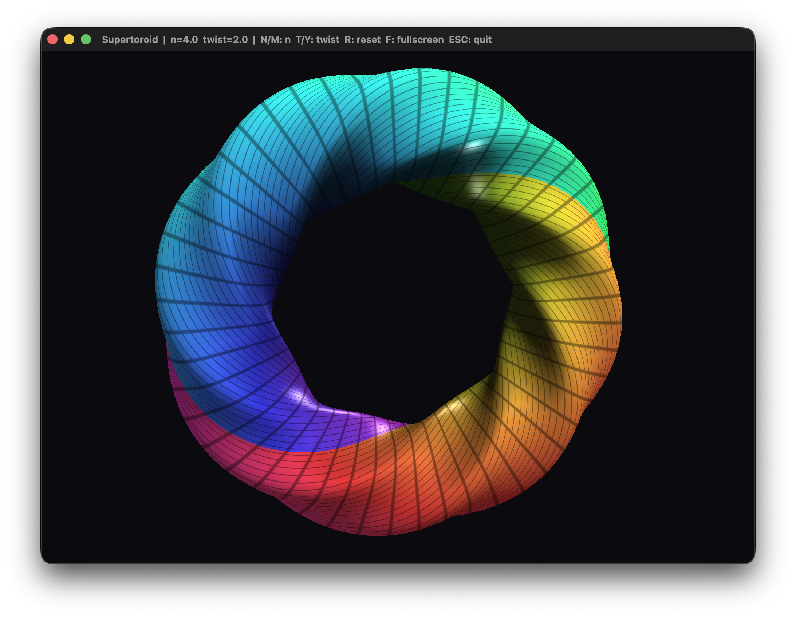

# Supertoroid

A real-time, zero-dependency GPU renderer for a **twisted supertoroid** — a torus whose
circular cross-section is replaced by a *superellipse* and rotated (twisted) as it sweeps
around the ring. Everything is written directly against the raw OS windowing and OpenGL
APIs, with no third-party libraries (no GLFW, GLEW/GLAD, GLM, or math/mesh helpers).

The same renderer is provided for two platforms:

| Platform | Language | Windowing        | OpenGL    | Entry file       |
| -------- | -------- | ---------------- | --------- | ---------------- |
| macOS    | Swift    | AppKit (`NSOpenGLView`) | 4.1 core | `main.swift`     |

## Screenshot


## The surface

The mesh is generated procedurally from these parametric equations:

```
R(v) = ( |cos v|^n + |sin v|^n ) ^ (-1/n)
phi  = t * u + v
x    = ( a + R * cos(phi) ) * cos(u)
y    = ( a + R * cos(phi) ) * sin(u)
z    =   R * sin(phi)
u, v ∈ [0, 2π]
```

- **`n`** — superellipse exponent (cross-section "squareness"): `n = 2` gives an ordinary
  round torus, larger `n` makes the profile boxier.
- **`t`** — twist: how many times the cross-section rotates per full loop around the ring.
- **`a`** — major radius.

Vertex normals are computed by central finite differences of the position function, so they
stay correct for any `n` and `t` without deriving an analytic normal by hand. At the default
tessellation (`Nu = 256`, `Nv = 128`) the surface is ~33k vertices / ~197k indices.

## Features

The renderer is a single translation unit per platform. Geometry is built on the CPU,
uploaded once to a static VBO/EBO, and re-generated only when a parameter changes. Shading
is done entirely in GLSL: a diffuse + specular + rim-light model over an animated rainbow
hue, with faint grid lines along the UV parameter space. The camera is a simple orbit/zoom
with a real depth buffer and back-face culling (CCW front faces).

## Controls

| Input                         | Action                          |
| ----------------------------- | ------------------------------- |
| Mouse drag                    | Rotate                          |
| Scroll                        | Zoom                            |
| `N` / `M`                     | Decrease / increase exponent `n`|
| `T` / `Y`                     | Decrease / increase twist `t`   |
| `R`                           | Reset parameters and camera     |
| `F11` (Windows) / `F` (macOS) | Toggle fullscreen               |
| `Esc`                         | Quit                            |

## Build

Needs macOS 10.14 or newer (desktop OpenGL caps out at 4.1 on macOS).

```bash
chmod +x build.sh
./build.sh
./supertoroid
```

OpenGL is deprecated on macOS but still functional, so the build prints deprecation
warnings. Append `-suppress-warnings` to silence them.

## License

MIT — use it however you like.

## Support

If you found this project interesting or useful, you can support my work:

[](https://github.com/sponsors/makarov-mm)